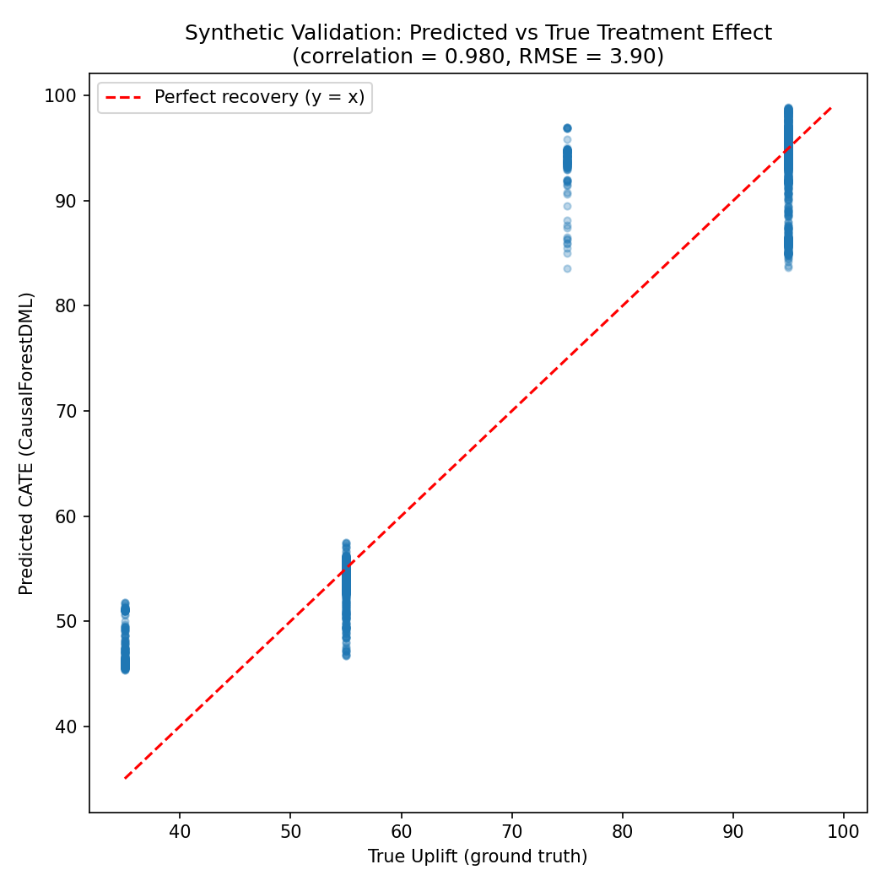
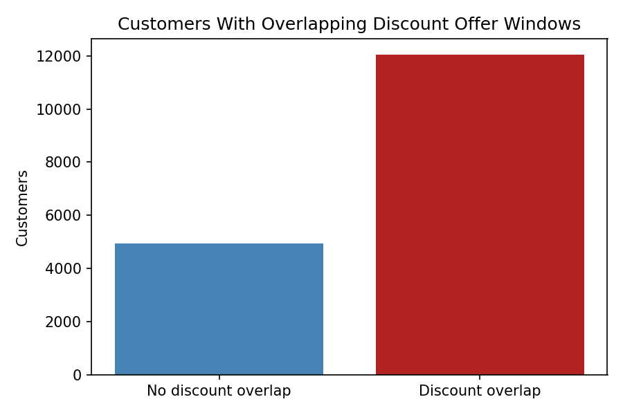
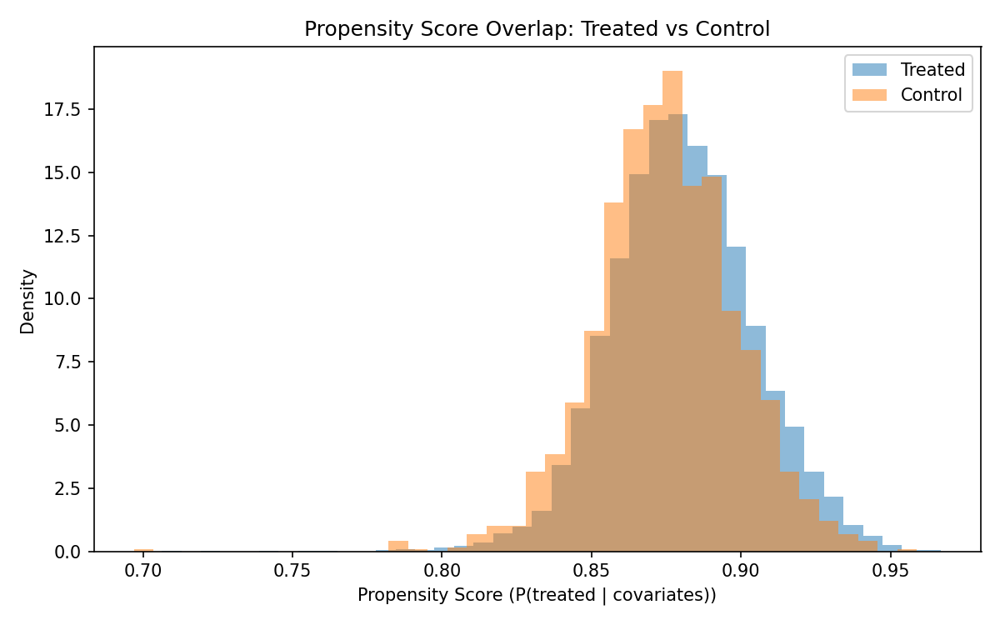
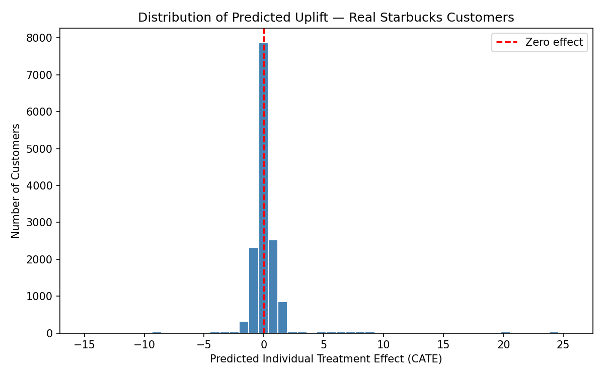
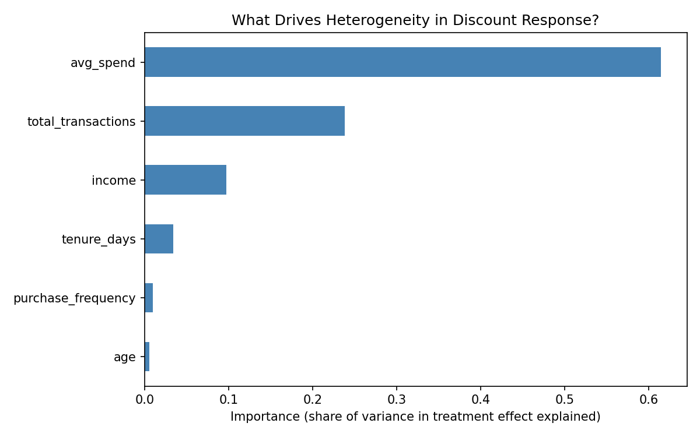
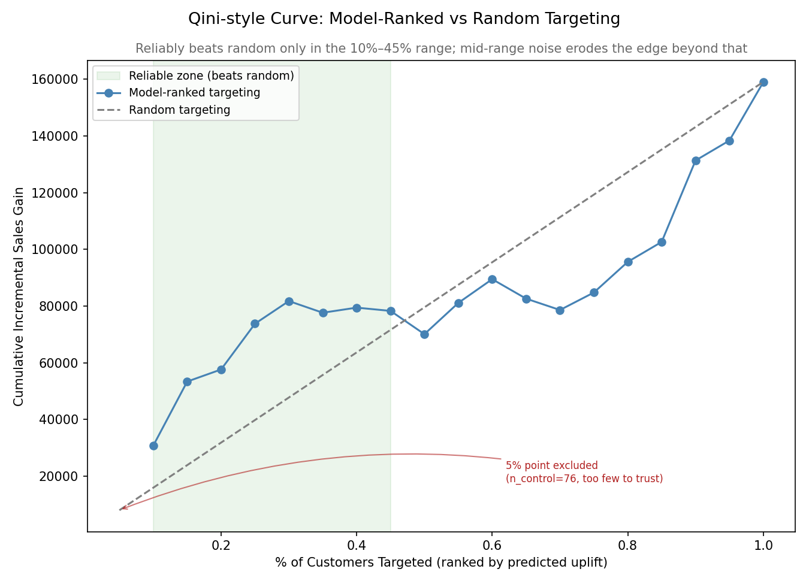
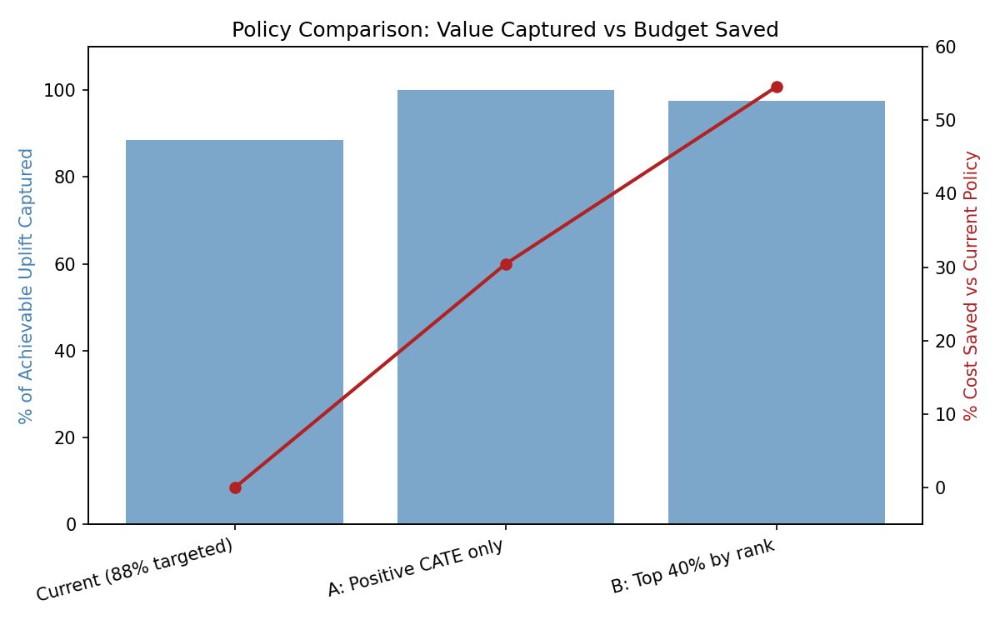

# Causal Uplift: Estimating Heterogeneous Marketing Effects with Causal Forests

**Does a discount offer actually drive incremental sales — or would customers have bought anyway? And for whom does it work best?**

This project applies causal machine learning (Double Machine Learning and Causal Forests) to the Starbucks promotional offer dataset to move beyond correlation and estimate the true, individual-level causal effect of a discount campaign — then turns that into a concrete, cost-saving targeting policy.

---

## Why this project exists

Most "marketing effectiveness" analyses stop at a naive comparison: average spend among people who got an offer vs. people who didn't. That comparison is almost always confounded — people who receive offers are rarely a random sample of the customer base. This project asks a harder, more useful question: **if we changed who got the discount, would outcomes actually change, and by how much for each type of customer?**

The methodology escalates in rigor at every stage, so each step's claim can be checked against the one before it:

```
Naive comparison → LinearDML (average effect) → CausalForestDML (individual effects)
```

Critically, the entire pipeline was **validated on synthetic data with a known ground truth before being trusted on real customer data.**

---

## Project Structure

```
data/raw           <- original Starbucks JSON files (portfolio, profile, transcript)
data/processed     <- cleaned, merged customer-level dataset
data/synthetic     <- generated synthetic validation dataset
notebooks/         <- narrated analysis notebooks (see below)
  scratch/         <- early, unpolished exploratory work
src/               <- reusable pipeline logic, importable by notebooks and scripts
reports/figures    <- all saved chart outputs
```

### Notebooks (start here)

| Notebook | Contents |
|---|---|
| `01_synthetic_validation.ipynb` | Proves the pipeline recovers a known, hand-specified treatment effect before touching real data |
| `02_data_preparation_eda.ipynb` | Real data recon, the offer-overlap discovery, attribution logic, final dataset construction |
| `03_causal_analysis.ipynb` | Naive baseline → LinearDML → CausalForestDML, CATE reliability check, subgroup findings, Qini curve |
| `04_policy_simulation.ipynb` | Converts findings into a targeting policy with quantified budget savings |

`notebooks/scratch/00_inspect_data.ipynb` contains early, unpolished exploratory work and is kept for transparency but isn't part of the main analysis sequence.

---

## How to Run

1. **Install dependencies**
   ```bash
   pip install pandas numpy scikit-learn econml scipy matplotlib
   ```

2. **Run the pipeline scripts in order** (from the project root)
   ```bash
   python src/synthetic_data.py       # generates data/synthetic/synthetic_customers.csv
   python src/data_prep.py            # builds data/processed/processed_starbucks.csv
   python src/baseline_models.py      # naive baseline + propensity overlap check
   python src/dml_ate.py              # LinearDML on synthetic + real data
   python src/causal_forest.py        # CausalForestDML, feature importance, CATE reliability
   python src/evaluation.py           # Qini curve
   python src/policy_sim.py           # policy simulation + savings estimate
   ```

3. **Or explore interactively via the notebooks** — open `notebooks/01_synthetic_validation.ipynb` through `04_policy_simulation.ipynb` in order. Each notebook imports directly from `src/`, so no logic is duplicated between the scripts and the notebooks.

All figures are saved to `reports/figures/` and all intermediate/final datasets to `data/processed/` and `data/synthetic/`.

---

## Methodology

### Phase 1 — Synthetic Validation

Before trusting any causal method on real data, we built a synthetic dataset of 8,000 customers with a **known, hand-specified heterogeneous treatment effect** and deliberately confounded treatment assignment (higher-income, longer-tenure customers were made more likely to receive the discount). This let us check whether each method could recover the truth:

| Method | Estimate | vs. True ATE (68.75) |
|---|---|---|
| Naive comparison | 62.88 | biased by -5.87 |
| LinearDML | 68.62–68.84 | within ~1% |
| CausalForestDML | 67.08–68.84 | within ~1–2%; individual CATEs correlate 0.98–0.99 with ground truth |



This confirmed the pipeline mechanics — data flow, model configuration, evaluation logic — were correct before applying them to messier, real-world data.

### Phase 2 — Real Data Preparation

The raw dataset (`portfolio.json`, `profile.json`, `transcript.json`) required careful reconstruction:

- **Offer windows** were built from `offer received` events + each offer's duration
- **A major finding**: ~71% of customers had a discount offer overlapping in time with another active offer — not an edge case, but the norm, driven by how offers were issued in waves. This ruled out simply excluding overlapping customers (would have removed ~71% of the sample and biased what remained).



- **Attribution decision**: last-touch attribution (credit the most recently *viewed* active offer) was built as a diagnostic layer — but explicitly **not used to define treatment**, since doing so would condition on post-treatment behavior (viewing) and reintroduce selection bias.
- **Treatment definition**: intent-to-treat — did the customer receive a discount offer at all, regardless of whether they viewed or completed it.
- **Outcome**: total transaction spend over the full observation period.
- 2,175 customers with placeholder/missing demographic data (`age == 118`) were excluded.

**Final dataset:** 14,825 customers — 13,042 treated, 1,783 control.

### Phase 3–4 — Naive Baseline & LinearDML

- **Naive effect:** 10.73 (95% CI: 4.61, 16.84), statistically significant
- **Propensity overlap check:** excellent overlap between groups (only 0.1% poor-overlap customers), and a propensity model AUC of just 0.564 — meaning offer assignment was close to random with respect to observed covariates



- **LinearDML estimate:** **7.20** (95% CI: 1.93, 12.46) — a ~33% downward correction from the naive estimate, larger than the weak propensity AUC alone would suggest. This is the project's **primary, trustworthy effect estimate**.

### Phase 5–6 — CausalForestDML & Heterogeneity

- **CATE reliability check:** only **~7% of individual-level predicted effects** had a 95% confidence interval that excluded zero — meaning most individual predictions cannot be statistically distinguished from "no effect," a direct consequence of the small control group (1,783 customers) relative to the estimation task.



- **Subgroup analysis rescued the signal:** high-income customers (>$90k) showed a significantly **negative** predicted effect (t = -19.32, p ≈ 0) — the project's strongest single statistical result.
- **Feature importance:** `avg_spend` and `total_transactions` were the dominant drivers of heterogeneity (not demographics) — consistent with the income finding, since `avg_spend` and `income` correlate at r = 0.47.



- **Qini curve:** the model's CATE ranking reliably beat random targeting in the **10%–45%** targeted range, with noise eroding the advantage beyond that — directly corroborated by a separate decile-level check.



### Phase 7 — Policy Simulation

| Policy | % Targeted | % of Achievable Uplift Captured | % Cost Saved |
|---|---|---|---|
| Current | 88% | 88% (baseline) | 0% |
| Positive-CATE-only | 61% | ~100% | 30% |
| **Top 40% by rank** | **40%** | **~98%** | **55%** |



**Recommendation:** targeting only the top 40% of customers by predicted uplift captures ~98% of the achievable incremental sales while cutting the discount budget by ~55%.

---

## Pitfalls & Fixes (kept visible, not sanitized out)

Real bugs found and fixed during this project, documented here because the debugging process is as informative as the final numbers:

1. **Missing `discrete_treatment=True`.** Both `LinearDML` and `CausalForestDML` default to assuming a continuous treatment. Since treatment here is binary, this caused `model_t` to be fit as a regression rather than a classifier, distorting the residualization step DML depends on. Fixing this improved both the synthetic validation (bias dropped from +0.73 to -0.13) and the real-data estimate.
2. **Under-restrictive `min_samples_leaf` in CausalForestDML.** The default (10) allowed forest leaves to form with almost no control observations, given the 1,783-customer control group — producing wildly unstable individual CATE estimates (ranging from -43 to +32) and an ATE that disagreed sharply with LinearDML. Raising `min_samples_leaf` to 50 stabilized this considerably.
3. **A misleading "% uplift captured" metric.** An early version of the policy simulation used the full-population CATE sum (including negative values) as the denominator, which allowed captured-uplift percentages to exceed 100% once negative-CATE customers were excluded from a policy. Fixed by using the sum of only *positive* CATEs as the theoretical ceiling.
4. **A `purchase_frequency` division artifact.** Dividing transaction count by tenure days without a floor produced absurd values (up to 360) for near-zero-tenure customers. Fixed by flooring the denominator at 30 days.

---

## Limitations

- **Control group is a minority of the sample** (1,783 of 14,825 customers, ~12%). Effect estimates — especially individual-level ones — rely on a comparatively small counterfactual population.
- **Only ~7% of individual CATE estimates are statistically distinguishable from zero.** Individual-level predictions should be treated as directional, not precise; subgroup and rank-based conclusions are considerably more trustworthy than any single customer's predicted score.
- **Real-data heterogeneity does not necessarily match the synthetic assumptions.** The synthetic validation assumed newer customers respond more strongly; real data showed the opposite direction for tenure. This is a reminder that synthetic pipeline validation proves mechanics, not real-world truth.
- **Unobserved confounding is possible.** Propensity overlap and balance were strong on *observed* covariates, but variables not present in this dataset (e.g., app engagement, notification settings, geography) could still confound the estimate.
- **This is observational, not experimental, validation.** The policy simulation's projected savings are based on model predictions on historical data. A live randomized holdout test would be needed before deploying this targeting policy at scale.

---

## Tech Stack

Python · `pandas` · `numpy` · `econml` (LinearDML, CausalForestDML) · `scikit-learn` · `scipy` · `matplotlib`